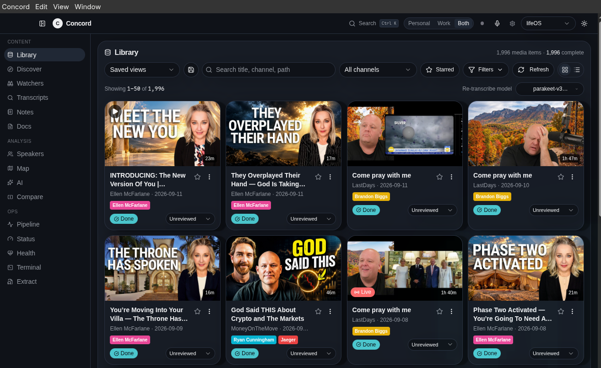
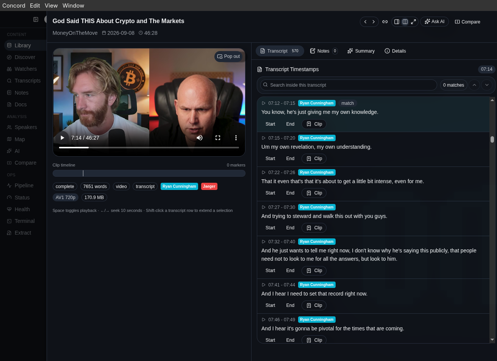
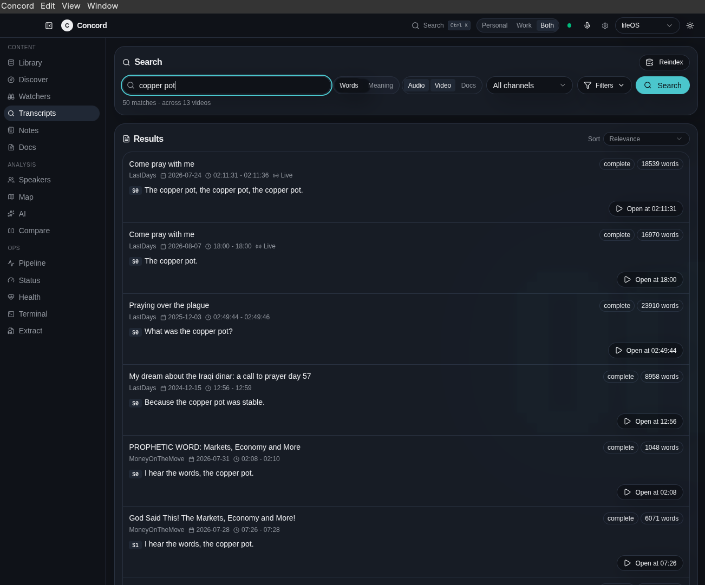
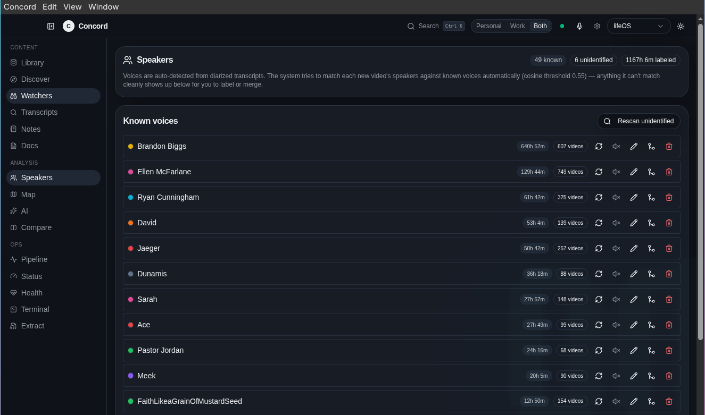
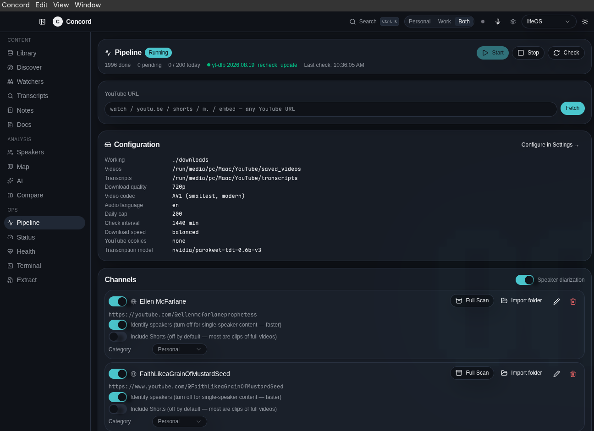
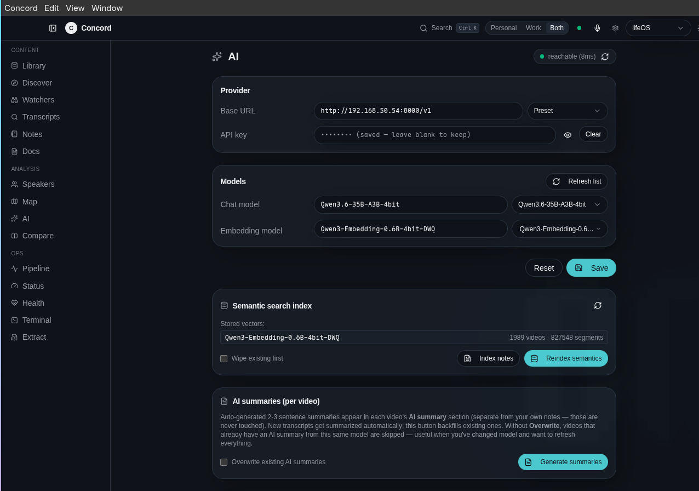

# Concord

A personal research archive for spoken-word media. Save videos and audio, transcribe them locally, and turn the useful parts into searchable transcripts, linked notes, and conversations with your archive.

Concord combines an Electron desktop app with a React interface, a local Node server, and SQLite storage. Linux transcription uses NVIDIA NeMo Parakeet or faster-whisper; Apple Silicon builds use FluidAudio.



## What you can do

- Download individual YouTube videos, follow channels, and import local media.
- Generate timestamped transcripts, with speaker diarization on the Parakeet path.
- Browse your library, search transcripts, and jump from a passage to its source video.
- Save quotes and research notes, organize them with tags, and explore their connections on a map.
- Keep documents alongside your media and compare sources side by side.
- Connect a model server for AI chat, summaries, and semantic search.
- Monitor background jobs, inspect runtime logs, and create database backups from the app.

Media processing and transcription run on your machine. AI features use the model endpoint you configure; a remote endpoint receives the text sent to it. Internet access is needed for downloads and initial model setup.

## Screenshots

Watch a video alongside its timestamped transcript, identify speakers, and save passages as clips.



<details>
<summary>Explore transcript search, speakers, the pipeline, and AI settings</summary>

**Transcript search** — find passages across the archive and open a video at the matching timestamp.



**Speakers** — review identified voices and their appearances across videos.



**Pipeline** — add YouTube sources, manage followed channels, and monitor processing.



**AI settings** — connect a model server, choose chat and embedding models, and manage indexing and summaries. The endpoint and model names shown are examples from one installation.



</details>

## Hardware and platforms

| System | Transcription path | Setup notes |
| --- | --- | --- |
| Linux with NVIDIA GPU, including a single RTX 5090 | Parakeet v3 through NeMo/CUDA | The wizard recommends Parakeet when it detects at least 8 GB VRAM. See the RTX 5090 check below. |
| Linux with Ryzen integrated graphics, or no NVIDIA GPU | faster-whisper on the CPU | Follow the CPU configuration step below. Integrated Radeon acceleration is not configured by Concord's installer. |
| Apple Silicon macOS | Parakeet through FluidAudio | Packaged builds bundle the transcription executable and skip Python setup. |

The CPU brand does not determine CUDA support: an AMD Ryzen CPU can be paired with an NVIDIA GPU. A single compatible NVIDIA card is sufficient. CPU transcription speed depends on the processor, model, and recording length.

Linux packages currently target x86-64, and macOS packages target arm64. There is no Windows packaging target in the current build configuration. Fresh Omarchy installation and RTX 5090 transcription still need end-to-end validation; the guidance here describes the intended setup and known limitations.

## Run from source on Linux / Omarchy

### Prerequisites

- Git, Node.js **24**, and **pnpm 10.23.0**. Desktop build tooling requires Node 22.12 or newer; Node 24 fits the current dependency versions.
- **Python 3.12** with pip and venv support. Concord's wizard accepts Python 3.10–3.13 and prefers 3.12. It deliberately rejects Python 3.14; install 3.12 alongside the system interpreter.
- **yt-dlp** installed at a supported system location, such as `/usr/bin/yt-dlp` on Arch, for source runs. Packaged builds bundle it.
- A C/C++ compiler and Make for native Node dependencies if prebuilt binaries are unavailable. Packaging also uses `curl` and standard shell utilities.
- For Parakeet: a working NVIDIA driver, with the GPU visible in `nvidia-smi`.
- Disk space for dependencies, model caches, and your media archive. The Parakeet Python stack alone is a multi-gigabyte download; models download separately on first use.

FFmpeg and FFprobe are supplied through platform-specific Node dependencies. You do not need to install NeMo or Whisper into the system Python environment.

### Install and launch

```bash
git clone https://github.com/Tech0001/Concord.git
cd Concord
```

With [mise](https://mise.jdx.dev/lang/python.html) installed and activated in your shell, select the project tools:

```bash
mise use node@24 pnpm@10.23.0 python@3.12
```

This creates a local `mise.toml` and installs/selects the tools for this checkout. If you already manage these versions another way, skip that command. Concord also detects side-by-side mise Python installations.

```bash
pnpm install --frozen-lockfile
mkdir -p dist/transcription-engines
cp server/transcription-engines/*.py server/transcription-engines/requirements-*.txt dist/transcription-engines/
pnpm run electron:dev
```

The copy step stages the Python scripts and requirements where the unbundled desktop server expects them. Repeat it after changes to those files; packaged builds include them automatically. The desktop command builds the app, rebuilds native dependencies for Electron, and opens Concord. Keep that terminal open while using it. Launch it again with `pnpm run electron:dev`.

For browser development instead of the desktop window:

```bash
NODE_ENV=development pnpm exec tsx server/index.ts
```

Open `http://127.0.0.1:5050`. This explicit command sets the environment correctly on Linux. If you have just run the Electron build, see the native-module troubleshooting note below before switching runtimes.

You can clone from an accessible Gitea remote instead; the hosting service does not change the installation process.

## First launch

Concord opens **Pipeline → Setup** before the first run. Setup and daily operation share one workspace:

- **Setup:** video/transcript folders, download preferences, and transcription installation and hardware settings.
- **Run pipeline:** sources, channel subscriptions, downloads, and processing jobs.
- **AI & extras:** optional model-server configuration, semantic indexing, summaries, and maintenance.

Choose your video and transcript folders, review the download defaults, and click **Save storage & downloads**. Schedule, cookies, and other advanced options are available in an expandable section. Install the recommended transcription engine in the same view, then click **Finish setup** when all required checks pass.

Run remains unavailable until setup is complete, and the server also rejects download/transcription requests while setup is incomplete. Completion is stored with your configuration, so it survives restarts and applies to every app window. Existing installations can review their current settings and finish without reinstalling an available engine. AI configuration is optional.

The installer chooses CPU/GPU settings and saves the correct Python path. It creates a dedicated environment under `${XDG_DATA_HOME:-$HOME/.local/share}/concord/venv` and verifies that the engine imports. Recreate this environment on each machine rather than copying a `venv` directory.

Finishing setup does not start downloads. Start with one short recording or video, open the finished transcript, and try a timestamp link before queuing a whole channel. Models download on first use, so that first transcription takes longer.

### NVIDIA / RTX 5090

Choose **Parakeet** and the `nvidia/parakeet-tdt-0.6b-v3` model. The normal pipeline defaults are `cuda` and `float16`. If this installation previously used CPU transcription, select **NVIDIA GPU** under **Pipeline → Setup → Model & hardware**, or apply the installed engine’s **Use recommended hardware settings** action.

RTX 5090 is a Blackwell GPU. PyTorch introduced Blackwell support in its 2.7 release with CUDA 12.8 wheels; the chosen PyTorch build must include Blackwell support and match the installed driver. See the [PyTorch release notes](https://pytorch.org/blog/pytorch-2-7/).

Concord pins `nemo_toolkit[asr]==2.7.3`, but does **not** independently pin PyTorch, its CUDA build, or all transitive dependencies. Successful package installation alone does not verify 5090 compatibility. After the wizard finishes, check the installed environment:

```bash
nvidia-smi
"${XDG_DATA_HOME:-$HOME/.local/share}/concord/venv/bin/python" - <<'PY'
import torch
print("PyTorch:", torch.__version__)
print("CUDA build:", torch.version.cuda)
print("CUDA available:", torch.cuda.is_available())
assert torch.cuda.is_available(), "CUDA is unavailable in Concord's environment"
print("GPU:", torch.cuda.get_device_name(0))
print("Compute capability:", torch.cuda.get_device_capability(0))
print("Compiled architectures:", torch.cuda.get_arch_list())
x = torch.ones((256, 256), device="cuda")
print("CUDA matrix operation:", (x @ x)[0, 0].item())
torch.cuda.synchronize()
PY
```

This checks a real CUDA operation. Follow it with a short Parakeet transcription to exercise the complete model stack. Speaker diarization uses a separate Sortformer model and runs after transcription, so its first use adds another model download.

### Ryzen with integrated graphics / CPU transcription

Choose **Whisper** in the wizard. Start with `small`, or `tiny` for a quicker installation check. Larger models require more memory and processing time. The [faster-whisper documentation](https://github.com/SYSTRAN/faster-whisper#usage) supports CPU inference with `int8` compute.

On a machine without NVIDIA, installing Whisper automatically selects `small`, CPU processing, `int8` compute, and the installed Python executable. Speaker diarization is disabled for Whisper because Concord's Whisper bridge does not provide it.

For an existing installation, use **Pipeline → Setup → Model & hardware** to select CPU and `int8`, or apply **Use recommended hardware settings** in the installed-engine panel. You can choose another Whisper model in that same view.

This machine is useful for testing installation, downloads, library features, and CPU transcription. It does not validate the NVIDIA/Parakeet path.

## Optional AI features

Transcription does not require a chat model server. For AI chat and semantic search, open **Pipeline → AI & extras** and configure an OpenAI-compatible endpoint, a chat model, and an embedding model. The UI includes an Ollama preset (`http://localhost:11434/v1`), and accepts other OpenAI-compatible endpoint URLs.

The vector index currently requires **1,024-dimensional embeddings**. Choose a model that returns that dimension; Concord validates incompatible dimensions before inserting vectors. Model IDs must match the names served by your endpoint. The MLX model suggestion shown in AI & extras is specific to Apple-oriented model servers and is not a Linux installation requirement.

Use the embedding reindex action in AI & extras to make existing transcripts available to semantic search. Downloading and running an AI model server is separate from Concord's transcription wizard.

## Build a Linux package

From the installed source checkout:

```bash
pnpm run electron:dist:linux
```

This downloads and checksums yt-dlp, builds Concord, and produces x86-64 **AppImage** and **deb** packages under `dist-electron/`. Use the AppImage for Omarchy/Arch; the deb targets Debian-based systems. Make the AppImage executable and launch it:

```bash
chmod +x dist-electron/Concord-*.AppImage
./dist-electron/Concord-*.AppImage
```

Keep only the intended version matching that glob when launching. The package includes the Node/Electron runtime, FFmpeg/FFprobe, and yt-dlp. Linux still needs a compatible Python interpreter and the first-launch transcription setup. A recipient running the package does not need the source build tools.

## Data and backups

| Data | Default Linux location |
| --- | --- |
| Library database and settings | `~/.local/share/concord/pipeline.db` |
| Wizard-managed Python environment | `~/.local/share/concord/venv/` |
| Managed yt-dlp binary | `~/.local/share/concord/bin/yt-dlp` |
| Desktop working files | Under `~/.local/share/concord/` |
| Saved videos and transcripts | The folders chosen in Pipeline setup |

The application data paths above honor `XDG_DATA_HOME`. Browser development uses the checkout as its working directory. Model downloads also use the model libraries' caches outside the source tree.

Use **Health → Backup and restore** for a consistent SQLite backup. Back up saved media and transcript folders separately; a database backup does not contain those files. Database restores are staged and applied on the next launch.

Databases, media, virtual environments, build output, and local environment files are ignored by Git. A fresh clone creates its own library; it does not include another user's archive or Python installation.

## Troubleshooting

- **Python not found or too new:** install Python 3.12 alongside the system Python, then reopen setup. With mise, `mise install python@3.12` makes an additional interpreter available to Concord's detector.
- **CUDA unavailable, unsupported GPU architecture, or “no kernel image”:** run the NVIDIA checks above. Confirm the driver and the PyTorch build inside Concord's own environment support your GPU. A working system Python installation is not sufficient.
- **Whisper tries CUDA on a Ryzen system, or cannot find `./venv/bin/python`:** apply the CPU configuration in Pipeline setup as described above.
- **NeMo warnings appear under `[parakeet:err]`:** this prefix labels stderr, which also carries warnings and progress bars. Check whether chunks continue completing and whether the job ultimately succeeds; a traceback or nonzero exit needs investigation.
- **YouTube downloads fail:** check yt-dlp health and the update action in the Run pipeline view. Source runs need a usable system yt-dlp or Concord's managed copy.
- **Native SQLite module / `NODE_MODULE_VERSION` mismatch:** Node and Electron need different native builds. Use `pnpm run electron:rebuild` before desktop runs, or `pnpm rebuild better-sqlite3` before returning to browser development. Stop the other runtime first.
- **Model loading is slow on first use:** package installation and model downloads are separate. Watch **Terminal** and **Status** for progress.

## Development layout

```text
client/                         React interface and themes
electron/                       Desktop window and app lifecycle
server/                         Express API, pipeline, and SQLite storage
server/transcription-engines/   Python bridges and engine requirements
scripts/                        Binary staging and maintenance tools
build/                          Icons and packaging resources
```

Use `pnpm run check` for TypeScript checks, `pnpm test` for the existing tests, and `pnpm run build` for the client/server/desktop bundles. Run Node-based checks with native modules built for Node, as described above.
